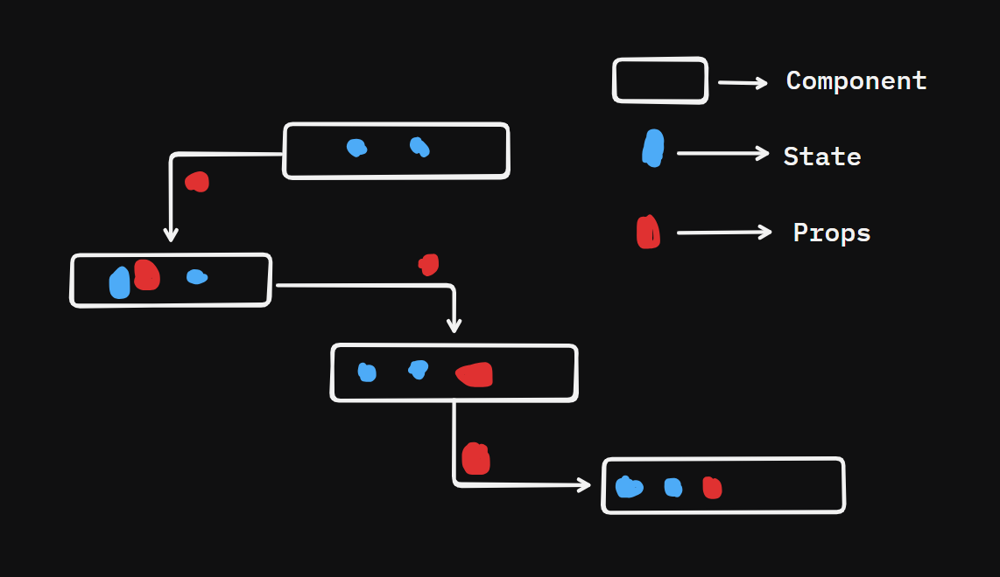

# What is a Component

- it is a Plain Old JS function.
- the function must Return "Something".
- The "Something" is the JSX.
- The component may have data private to itself. We call it **_"State"_**.
- The component may have data to share with other Components. We call them **_"Props"_**.

## State and Props

- A component has its own private data which is called **_States_**. but this component has to interact with another component.
- to interact with other componets we need to pass something called **_props_**.
- ==State==: states are like local variable to a function.
- ==Props==: props are the argument we pass to another component to exchange data.
