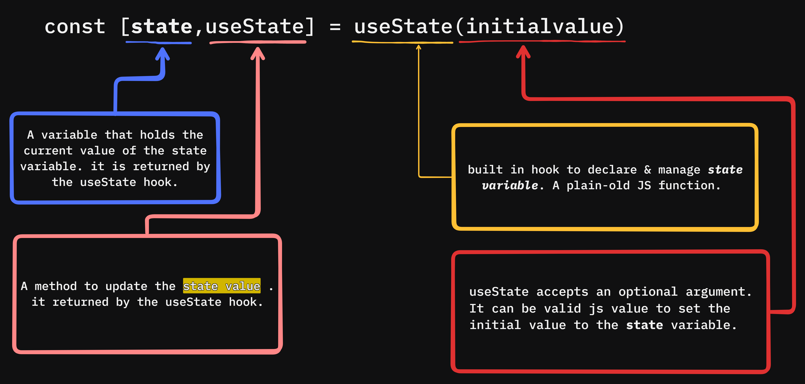

# useState

- `useState` is a built in standard react hook to declare and track the state variables value of your component.
- syntax: `const [state,setState] = useState(initialValue)`
  <br/>
  

## Best Practice

- use `setCounter((prev) => prev + 1)` instead of `setCounter(counter + 1)`
- because React states updates are asynchronous and we might face inconsistency.

---

- ```jsx
  const handleClick = () => {
    setCounter(counter + 1);
    setCounter(counter + 1);
  };
  ```
- we might expect 2 but it will return 1.it renders the current state value and increments it by 1.

---

- ```jsx
  const handleClick = () => {
    setCounter((prev) => prev + 1);
    setCounter((prev) => prev + 1);
  };
  ```
- it will give me 2 because:
- "prev = previous/latest" state value
- React guarantees that prev is always correct

---

-Example:

```jsx
import { useState } from "react";

const Practice = () => {
  const [counter, setCounter] = useState(0);

  return (
    <div>
      <h1>COUNTER</h1>

      <h1>{counter}</h1>

      <button onClick={() => setCounter((prev) => prev + 1)}>Increment</button>
    </div>
  );
};

export default Practice;
```
